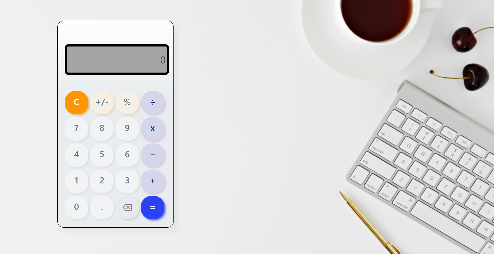
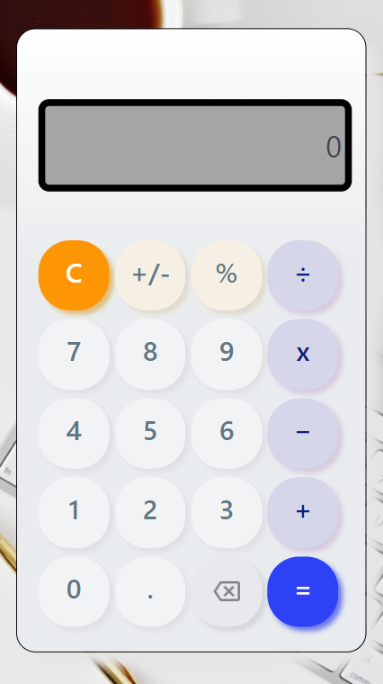

<p align="center">
    <a href="https://leonidasesteban.com/proyectos/todos"></a>
</p>

<p align="center">
    Aplicación creada a partir de un diseño entregado por Proyectos de 
    <a href="https://leonidasesteban.com/">leonidasesteban.com</a>
</p>

## Requerimientos

<a href="https://nodejs.org/es/">NodeJS</a>

## 🔥 Instalación

```shell
npm install
```
## 🔥 Servidor

Ejecutar 
```shell
npm run start
```
para un servidor local. Navega a http://localhost:8000/

## 🔍 Vistas 

### 💻 Desktop



### 📱 Mobile



## 🌟 Autor

* **<Maritza Loaiza>**  [@Maritza_Loaiza](https://github.com/Maritza7395)
> Puedes encontrar más proyectos en
[LeonidasEsteban.com](https://leonidasesteban.com/proyectos/todos)
